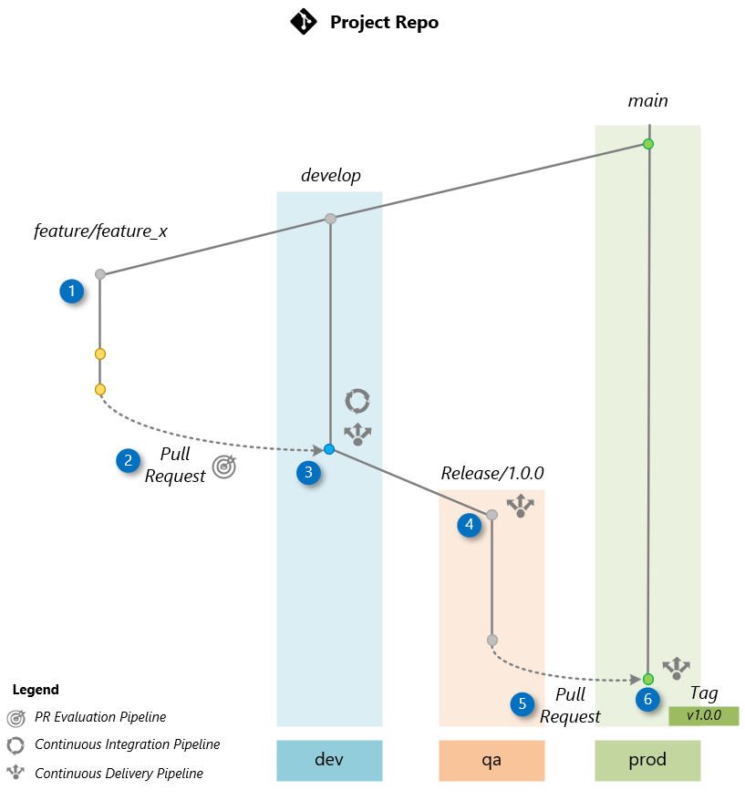
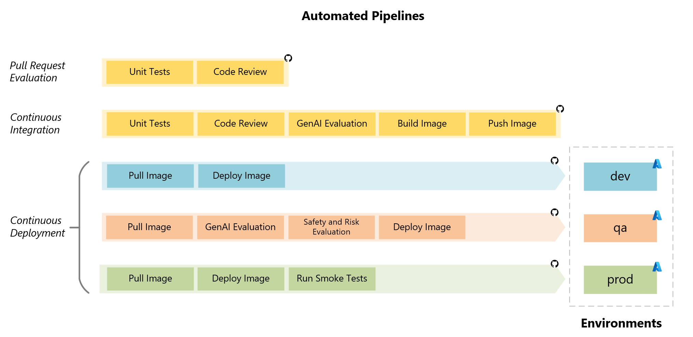

# Git Workflow and Pipelines

This section presents a practical Git workflow example that illustrates how branches and releases can trigger automation pipelines. Based on the popular [Git flow](https://nvie.com/posts/a-successful-git-branching-model) model, it helps manage multiple environments—**dev**, **qa**, and **prod**—but can be adapted to fit your project's needs.


## Overview

The diagram below illustrates our workflow for delivering a new feature (here “Feature X”) as part of rekease 1.3.0. Each automated pipeline plays a role in the process—some ensure code quality or run AI-assisted evaluations, while others handle deployment to the appropriate environment.




## Steps

1. **Create a Feature Branch**
   Create a new branch off of **develop** for your work on Feature X:

   ```bash
   git checkout develop
   git pull origin develop
   git checkout -b feature/feature_x
   ```

   Do all your development in `feature/feature_x`.

2. **Open a PR to develop**
   When your changes are ready, push the branch and open a PR against **develop**. This fires the **PR Evaluation Pipeline** (linting, unit tests, AI-driven checks):

   ```bash
   git add .
   git commit -m "Implement Feature X"
   git push origin feature/feature_x

   gh pr create \
     --base develop \
     --head feature/feature_x \
     --title "Feature X" \
     --body "Adds Feature X and updates orchestration flow."
   ```

3. **Merge into develop & Deploy to dev**
   Once approved, merge the PR into `develop`. That triggers:

   * **CI Pipeline**: Builds the flow and runs full AI-assisted tests.
   * **CD Pipeline**: Deploys the updated flow to the **dev** environment.

4. **Tag a Release Candidate & Deploy to QA**
   After validating in **dev**, tag a release candidate from `develop`:

   ```bash
   git checkout develop
   git pull origin develop
   git tag -a v1.3.0-rc1 -m "Release Candidate 1 for v1.3.0"
   git push origin v1.3.0-rc1
   ```

   Pushing this tag triggers the **CD Pipeline** to deploy the RC to **qa** for UAT and red-teaming.

5. **Open a PR to main from the RC tag**
   When the RC passes QA, open a PR targeting **main** using the RC tag as the source:

   ```bash
   gh pr create \
     --base main \
     --head v1.3.0-rc1 \
     --title "Release v1.3.0" \
     --body "Merge release candidate v1.3.0-rc1 into main after QA approval."
   ```

   This ensures the exact tested candidate is promoted.

6. **Reviewer Approves & Merges**
   A reviewer reviews the PR. Once approved, merge it into `main`, which triggers the **CD Pipeline** to prepare for production.

7. **Create Final Release & Deploy to prod**
   Tag the final version on `main` and publish a GitHub Release:

   ```bash
   git tag -a v1.3.0 -m "Release v1.3.0"
   git push origin v1.3.0

   gh release create v1.3.0 \
     --target main \
     --title "v1.3.0" \
     --notes "Release 1.3.0: Feature X complete and deployed to production."
   ```

   This final tag triggers the **CD Pipeline** to deploy v1.3.0 to the **prod** environment.

## CI/CD Pipelines

The CI/CD (Continuous Integration/Continuous Deployment) pipelines automate integration, evaluation, and deployment processes, ensuring efficient delivery of high-quality applications.



**The Pull Request Evaluation Pipeline** begins with unit tests, followed by a code review to validate code changes before integration.

**In the Continuous Integration Pipeline**, the process starts with unit tests and code reviews, followed by GenAI-assisted flow evaluation to identify potential issues. The application is then built, and the flow image is registered for deployment.

**The Continuous Deployment Pipeline** operates across three environments: dev, qa, and prod. Provisioning of resources is performed when necessary, and the deployment of the application is executed in the respective environment.

- **In the dev environment**, the latest code is pulled, and the application is deployed for the development team's testing.

- **In the qa environment**, the code is retrieved, and AI-assisted evaluations for quality and safety are conducted, followed by integration testing. The application is then deployed and made available for User Acceptance Testing (UAT).

- **In the prod environment**, the same image built in the Continuous Integration Pipeline is deployed, ensuring consistency and reliability. Integration testing is conducted, and smoke testing ensures functionality post-deployment.

This structured approach streamlines workflows, reduces errors, and guarantees the efficient delivery of applications to production.