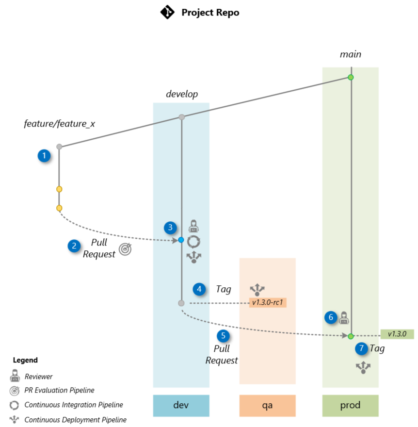

# Git Workflow and Pipelines

This section presents a practical Git workflow example that illustrates how branches and releases can trigger automation pipelines. Based on the popular [Git flow](https://nvie.com/posts/a-successful-git-branching-model) model, it helps manage multiple environments—**dev**, **qa**, and **prod**—but can be adapted to fit your project's needs.

## Overview

The diagram below illustrates our workflow for delivering a new feature (here “Feature X”) as part of release 1.0.0. Each automated pipeline plays a role in the process—some ensure code quality or run AI-assisted evaluations, while others handle deployment to the appropriate environment.

## Steps

1. **Create a Feature Branch**
   Create a new branch off of **develop** for your work on Feature X:

   Do all your development in `feature/feature_x`.

2. **Open a PR to develop**
   When your changes are ready, push the branch and open a PR against **develop**. This fires the **PR Evaluation Pipeline** (linting, unit tests, AI-driven checks):

3. **Merge into develop & Deploy to dev**
   Once approved, merge the PR into `develop`. That triggers:

   * **CI Pipeline**: Builds the flow and runs full AI-assisted tests.
   * **CD Pipeline**: Deploys the updated flow to the **dev** environment.

4. **Create a Release Branch**
   Creating this branchtriggers the **CD Pipeline** to deploy to **qa** for UAT and red-teaming.

5. **Open a PR to main from the Release Branch**
   When the new Release passes QA, open a PR targeting **main**

6. **Create Final Release & Deploy to prod**
   Tag the final version on `main` and publish a GitHub Release:

   This final tag triggers the **CD Pipeline** to deploy v1.0.0 to the **prod** environment.

## CI/CD Pipelines

The CI/CD (Continuous Integration/Continuous Deployment) pipelines automate integration, evaluation, and deployment processes, ensuring efficient delivery of high-quality applications.

**The Pull Request Evaluation Pipeline** begins with unit tests, followed by a code review to validate code changes before integration.

**In the Continuous Integration Pipeline**, the process starts with unit tests and code reviews, followed by GenAI-assisted flow evaluation to identify potential issues. The application is then built, and the flow image is registered for deployment.

**The Continuous Deployment Pipeline** operates across three environments: dev, qa, and prod. Provisioning of resources is performed when necessary, and the deployment of the application is executed in the respective environment.

- **In the dev environment**, the latest code is pulled, and the application is deployed for the development team's testing.

- **In the qa environment**, the code is retrieved, and AI-assisted evaluations for quality and safety are conducted, followed by integration testing. The application is then deployed and made available for User Acceptance Testing (UAT).

- **In the prod environment**, the same image built in the Continuous Integration Pipeline is deployed, ensuring consistency and reliability. Integration testing is conducted, and smoke testing ensures functionality post-deployment.

This structured approach streamlines workflows, reduces errors, and guarantees the efficient delivery of applications to production.