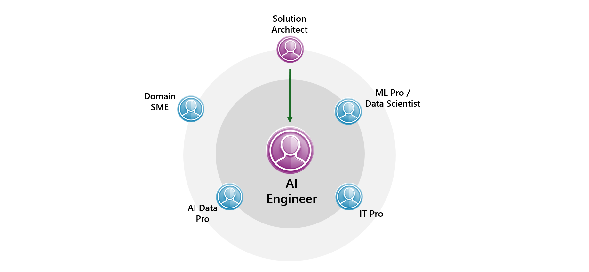

# Typical Roles in an GenAI Project

This section focuses on the primary roles in a GenAI project and their responsibilities. The diagram below shows all project roles at a glance, while the following descriptions cover only the most critical ones:

## AI Engineer

- **Leading Development**: Guides the project's development, making sure everything runs smoothly.
- **Building the App**: Works on coding and putting together different parts of the application.
- **Creating Prompts**: Designs the prompts the application uses, ensuring they're effective and meet project needs.
- **Managing Data**: Organizes, chunk and labels data, sets up custom indexes.
- **Overseeing Data Flow**: Manages data flow systems for seamless integration.
- **Production Readiness**: Guarantees the solution is reliable and deployment-ready.

## Data Scientist

- **Improving Search**: Enhances retrieval efficiency and accuracy.
- **Working on Prompts with AI Engineers**: Helps fine-tune the prompts with AI Engineers.
- **Tuning the Models**: If needed, adjusts models to improve how they perform and the results they give.

## Infrastructure Team / IT Pro

- **Setting Up Resources**: Manages technical resources for project setup.
- **Handling Access**: Manages access rights, ensuring security and project accessibility.