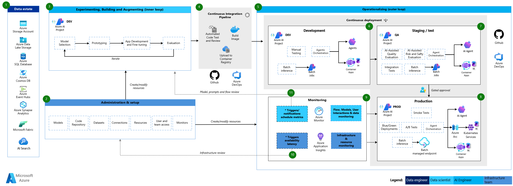

# Reference Architecture

This section presents a reference architecture for GenAIOps. It highlights how Azure AI Foundry, AI Agent Service and Container Apps can be combined to support data ingestion, experimentation, CI/CD and scalable deployment. Use it to compare against your own designs, adapt key patterns to your environment and accelerate decision-making around infrastructure, governance and operational workflows.

1. **Data estate**  
   All raw and curated datasets are securely stored and managed in Azure Storage, Data Lake Storage, Azure SQL Database and Azure Cosmos DB, forming a single source of truth that supports grounding, indexing, model development and evaluation.

2. **Administration & setup**  
   Azure AI Foundry project resources—including models, code repositories, datasets, connections and role-based access—are provisioned and configured through IaC templates to enforce consistency and governance.

3. **Experimenting, Building and Augmenting (inner loop)**  
   Data scientists iterate rapidly on model selection, prototyping and fine-tuning within the Azure AI Foundry dev environment, using CI-backed container images to validate performance.

4. **Continuous Integration Pipeline**  
   Every change to code, prompts or model artifacts is automatically tested, containerized and pushed to Azure Container Registry to guarantee reproducible builds.

5. **Operationalizing (outer loop)**  
   Container images are deployed to Azure Container Apps and AI Agent Service environments via continuous deployment pipelines, promoting rapid rollout across environments.

6. **Development environment**  
   Within the DEV AI Foundry project, agents are orchestrated and deployed as long-running Container Apps, with manual and batch inference tests ensuring baseline quality.

7. **Staging/test environment**  
   The QA AI Foundry project hosts A/B and safety evaluations, integration tests and batch inference workloads in Container Apps to validate release candidates under production-like conditions.

8. **Production environment**  
   Approved AI agents and containerized services run in the PROD AI Foundry project on Azure Container Apps and Kubernetes via Azure Arc, with blue/green deployments, smoke tests and managed batch endpoints ensuring reliability.

9. **AI service monitoring**  
   Azure Monitor tracks AI Agent Service metrics—such as flow executions, user interactions and model performance—to maintain real-time visibility into service quality.

10. **Infrastructure monitoring**  
   Azure Application Insights captures container-level telemetry—including availability, latency and resource utilization—for all Container Apps and backend services.

11. **Alerting & notifications**  
   Scheduled and threshold-based alerts are configured in Azure Monitor to trigger notifications for pipeline failures, performance regressions or capacity issues, enabling proactive operations.