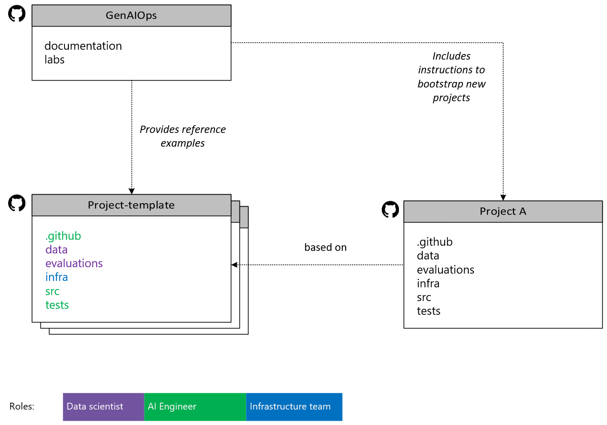

# Repository Structure

This guide utilizes project templates as its foundation. Therefore, the repository system is structured to include a primary repository, which contains comprehensive guidance for working with projects based on these templates. To maintain simplicity and promote cohesion within each repository, a separate repository is allocated for each project template. Additionally, dependencies between the primary repository and the template repositories are minimized. The diagram below illustrates the proposed structure.

## Repositories and their Directories

This section describes the directory structure used in the GenAIOps accelerator. By following this directory structure, teams can ensure a consistent and organized approach to developing and managing their GenAI Apps projects.

### GenAIOps

The `GenAIOps` repository is the central hub, offering detailed documentation that explains how to work with projects based on templates. It supports both direct use and customization via copy or fork. It includes the following:

* **documentation**: Contains setup guides and conceptual explanations for the GenAIOps accelerator.
* **labs**: Contains exercises you can perform using a sample project template to learn GenAIOps in practice.

### GenAI Project-template

The `GenAI Project-template` consists of repositories that serve as templates for GenAI apps and can be used to bootstrap new projects. While the structure may vary based on specific needs, a typical GenAI App project template includes the following subdirectories:

* **.github**: GitHub-specific workflows and actions for continuous integration and deployment.
* **.azdo**: Azure DevOps-specific workflows and actions for continuous integration and deployment.
* **data**: Stores datasets required for training and evaluation.
* **evaluations**: Contains scripts and resources to evaluate the performance of the trained models.
* **infra**: Includes infrastructure-related code and configurations, such as Bicep or Terraform scripts.
* **src**: Source code for the project, including orchestration flows, model definitions, training scripts, and utilities.
* **tests**: Contains test cases and scripts to ensure code quality and correctness.

For an example of a project template, see this [GPT-RAG](https://github.com/Azure/gpt-rag-orchestrator/tree/v2.0.0) template.

### Project A (Bootstrapped Project)

`Project A` represents a project that has been bootstrapped from the template. We're calling it Project A for illustration purposes, but it can be named appropriately for your use case. It will have the same initial directory structure as the template.