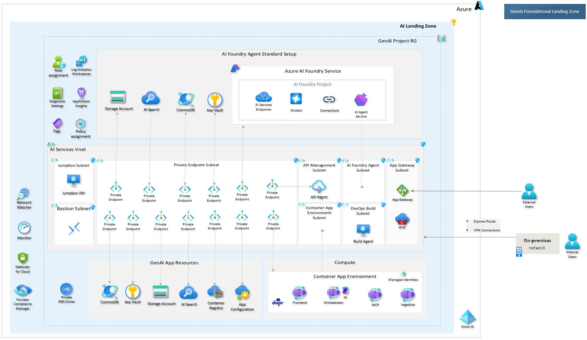
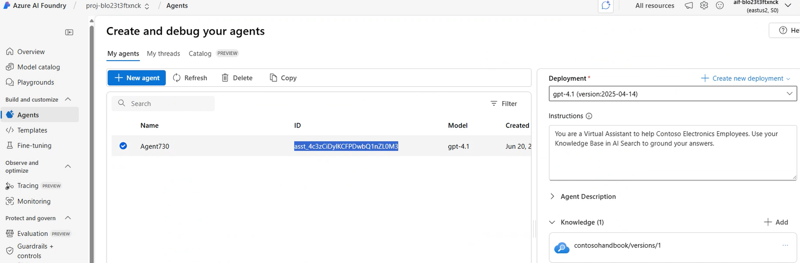
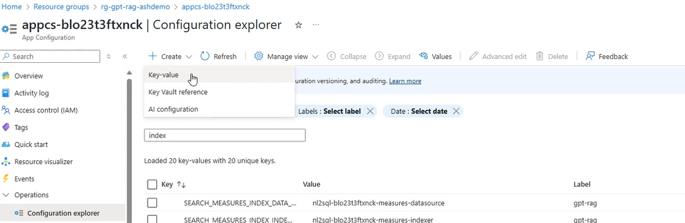
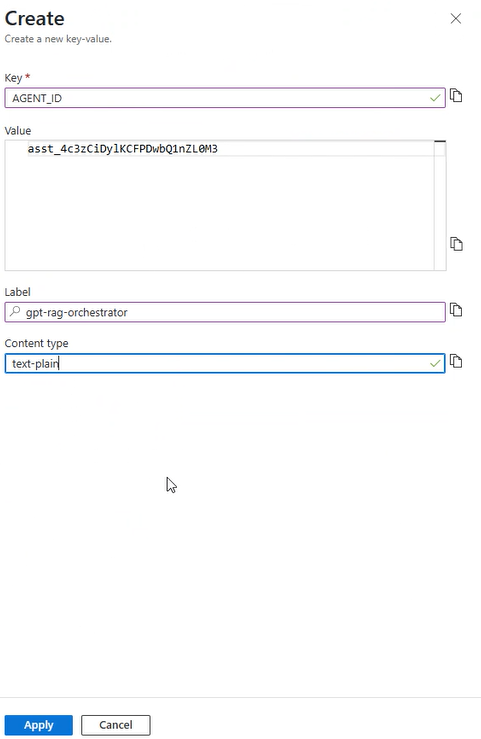
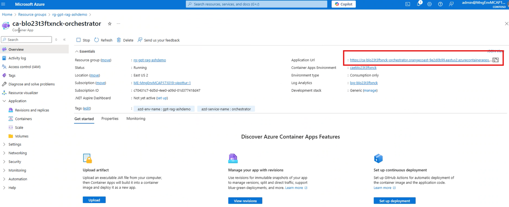

# Building Your GenAI App

> 🎥 **Watch the step-by-step demo**: [Building GenAI App](https://www.youtube.com/embed/RYJsekbciXs?autoplay=1)

In this lab you’ll review your GenAI landing-zone architecture, explore the dev environment you provisioned in bootstraping, then deploy the orchestrator code from the GPT-RAG template into that same environment.



_Above: the GenAI landing zone and AI Foundry Agent standard setup you provisioned with **azd provision**._

## Success Criteria

- Identify all deployed resources in the Azure Portal “dev” environment  
- Clone the GPT-RAG Orchestrator template and configure it against your existing azd environment  
- Deploy the orchestrator Container App and successfully POST to `/orchestrator` endpoint  

## Prerequisites

<details markdown="block">
<summary>Expand to view prerequisites</summary>

- **Bootstraping**: Ensure you have completed the bootstraping process and have a running environment. 

### Required Tools & Access  
 
- **Docker**, if you use Windows you can [Download and install Docker Desktop](https://docs.docker.com/get-started/introduction/get-docker-desktop/).  

</details>

## Task 1: Review Your Architecture in the Portal

1. Open the Azure Portal and navigate to the **Resource Group** you created in bootstraping.  
2. Verify these key resources exist:  
   - Container Apps environment (Orchestrator and other apps)  
   - Azure AI Search Service with rag index
   - Cosmos DB with Conversations container
   - Azure AI Foundry Project & AI Agent Service  
3. Explore the resources and their configuration.

## Task 2: Clone the Orchestrator Template

1. In your browser, go to https://github.com/Azure/gpt-rag-orchestrator.git  
2. Click the green button **Use this template**, name it (e.g. contoso-orchestrator), and create.  

> [!IMPORTANT]
> Make sure to select `include all branches` and also make it `Public`


3. Back to your terminal go to the workspace folder you created before (if you're not there yet):
```   
   cd workspace
```
4. Clone your new repo locally and change directory:  
```   
   git clone https://github.com/<your-org>/contoso-orchestrator.git  
   cd contoso-orchestrator
```

4. Switch to the genaiops-workshop branch:  
```
   git switch genaiops-workshop
```

## Task 3: Explore the Orchestrator Code

1. Open the `contoso-orchestrator/` folder in your code editor.

2. Find the `Orchestrator` class located in `src/orchestration/orchestrator.py`.

3. Review the `stream_response()` method to understand how the high-level orchestration flow works.

You’ll see that it's possible to choose the agent strategy. In our example, we’ll use a strategy based on an AI Foundry Single Agent.

4. Check the `SingleAgentRAGStrategy` class in `src/strategies/single_agent_rag_strategy.py` and explore its methods to understand how the agent works.

## Task 4: Hook into Your Existing AZD Environment

1. Refresh azd environment settings:  
```   
       azd env refresh  
```

2. When prompted, select the **existing** environment, subscription and resource group from Bootstraping.  

   _Do not create a new resource group – reuse your dev environment._

## Task 5: Configure Your Orchestrator to Use the Agent You Created During Prototyping

1. Go to the Agent page in AI Foundry and copy the **Agent ID**.

   

2. Navigate to your app’s configuration settings and add a new key/value pair.

   

3. Set the key to **AGENT_ID** and paste in the ID you copied in step 1 as the value. Use **gpt-rag-orchestrator** as the label, and select **text/plain** for the content type.

   

## Task 6: Deploy the Orchestrator

1. Login to Azure:  
```
       az login  
``` 

2. Deploy to Azure Container Apps:  
```
       azd deploy  
``` 

2. Wait for the CLI to finish and get your orchestrator app url in the portal:  



## Task 7: Test Your Endpoint

1. In any REST client like [HTTPie](https://httpie.io/app), send a POST to your orchestrator URL with the url followed by `/orchestrator`, for example:

       https://capp-vgo24eyyo4gf1-orchestrator.kindmushroom-0bbe9868.swedencentral.azurecontainerapps.io/orchestrator  

and this JSON body:

```
       {
         "conversation_id": "",
         "ask": "Describe the Contoso Electronics employee benefits program."
       }  
```


2. Confirm you receive a streamed, handbook-grounded response.  

3. Try another HR question, such as:  
   - "What are Contoso Electronics Company Values?"

Congratulations—you’ve deployed your GenAI orchestrator into your dev environment and verified end-to-end functionality!  
