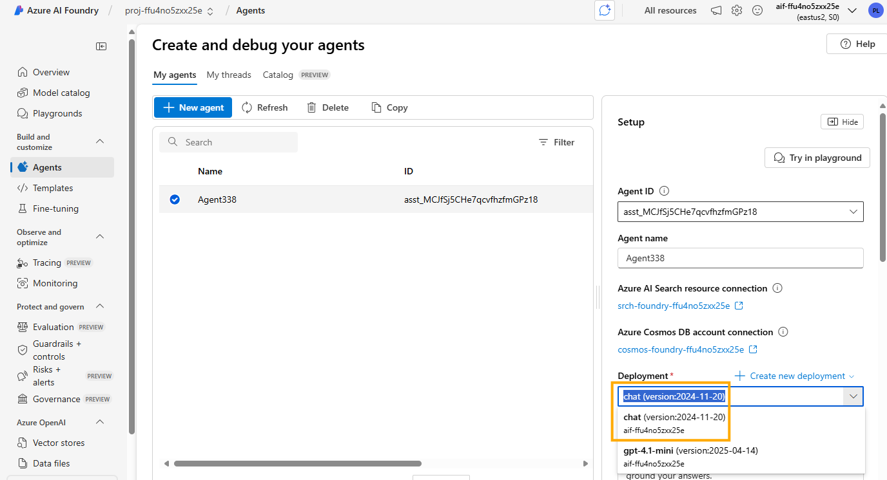

# Lab: Evaluating Your App Responses

> 🎥 **Watch the step-by-step demo**: [Evaluating your App](https://www.youtube.com/embed/Pv2FHpBlh0Q?autoplay=1)

In this lab, you’ll use the built-in evaluation harness in gpt-rag orchestrator template to measure how well your agent answers real questions from your knowledge base (e.g., the Contoso Electronics Employee Handbook). The template includes an `evaluations` folder with a Python script (`evaluate.py`) and a test dataset (`golden-dataset.jsonl`). You will run that script from PowerShell (or a shell), inspect the JSON output locally, then review the same results in the Azure AI Foundry portal under your AI Foundry project’s **Evaluations** tab.

## Success Criteria

* Locate and inspect evaluation code and data in your cloned repository
* Install all Python dependencies and load environment variables correctly
* Run the evaluation script.
* Understand the key metrics produced (e.g., similarity scores)
* Open the AI Foundry project in Azure Portal and view the evaluation entry

## Prerequisites

<details markdown="block">
<summary>Click to expand prerequisites</summary>

* **Bootstrap**: Complete the bootstrapping lab and have a running environment.
* **Prototyping and Building**: Finish the prototyping and building labs.
* **Tools**:

  * **Visual Studio Code** (or your preferred editor).
  * **Azure CLI** installed and authenticated (`az login`).
  * **PowerShell** (Windows) or a compatible shell.
  

</details>

## Task 1: Update Your Agent Model

Before running evaluations, update your agent’s chat model to ensure consistency with the lab assumptions. In the AI Foundry portal, update the model deployment used by your agent to **chat**.

1. In the Azure Portal, navigate to your AI Foundry project.
2. Go to the **Agents** page and select the agent you created.
3. On the agent page, select the **chat** model deployment and save it.



## Task 2: Locate Evaluation Code and Data

1. Open a terminal and navigate to your local repository:

   ```bash
   cd workspace/contoso-orchestrator
   ```

2. Ensure you are on the correct branch (e.g., `genaiops-workshop`):

   ```bash
   git switch genaiops-workshop
   ```

3. Open the project in Visual Studio Code (or your editor):

   ```bash
   code .
   ```

4. Verify you see:

   * `evaluations/generate_eval_input.py`: generates evaluation input data.
   * `evaluations/evaluate.py`: runs the AI Foundry evaluation.
   * `evaluations/dataset/golden-dataset.jsonl`: JSON Lines file with sample queries and ground truth.

5. Open these files to familiarize yourself with the data format and evaluation logic.

## Task 3: Review Evaluation Scripts

1. In `generate_eval_input.py`, inspect how test queries and expected responses are formatted and prepared.
2. In `evaluate.py`, review which evaluators and metrics are used (e.g., similarity evaluators).

> **Tip:** Understanding the metrics helps interpret results and adjust your agent if needed.

## Task 4: Configure Environment and Run Evaluation

1. **Azure CLI Login**: Ensure you are authenticated:

   ```powershell
   az login
   ```

2. **Set environment variables**: Export the App Configuration endpoint that the evaluation scripts expect. 

In PowerShell (Windows):

   ```powershell
   $Env:APP_CONFIG_ENDPOINT = "https://<your-app-config-name>.azconfig.io"
   ```

   Or in Bash (macOS/Linux):

   ```bash
   export APP_CONFIG_ENDPOINT="https://<your-app-config-name>.azconfig.io"
   ```

3. **Run the evaluation script**:

   * In PowerShell (Windows):

     ```powershell
     .\evaluations\evaluate.ps1
     ```
   * In Bash (macOS/Linux):

     ```bash
     ./evaluations/evaluate.sh
     ```

4. The script will generate input, submit the evaluation to AI Foundry.

5. The script typically prints a URL or ID to view the evaluation run in the AI Foundry portal.

> **Note:** Evaluation may take a few minutes. Be patient and monitor console output for any errors.

## Task 5: Inspect Results in AI Foundry Portal

1. **Portal Inspection**:

   1. Click the link provided by the script output to go directly to the evaluation page in AI Foundry Portal.

   or

   1. In the Azure Portal, navigate to your AI Foundry project.
   2. Select the **Evaluations** tab.
   3. Locate the latest evaluation entry (by timestamp or ID printed by the script).
   4. Click into the entry and review summary metrics.
   5. Go to the **Data** (or **Details**) section to see per-query results and any additional diagnostic information.


## Conclusion

Congratulations! You have successfully run an evaluation of your GenAI App and examined the results both locally and in the AI Foundry Portal. Next up: Lab – Automating Deployment with CI/CD.
