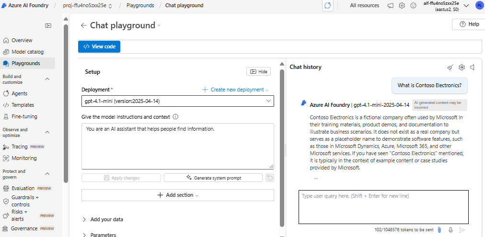
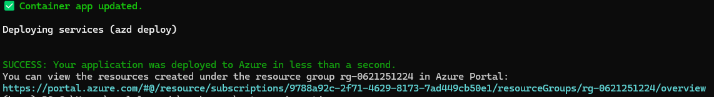
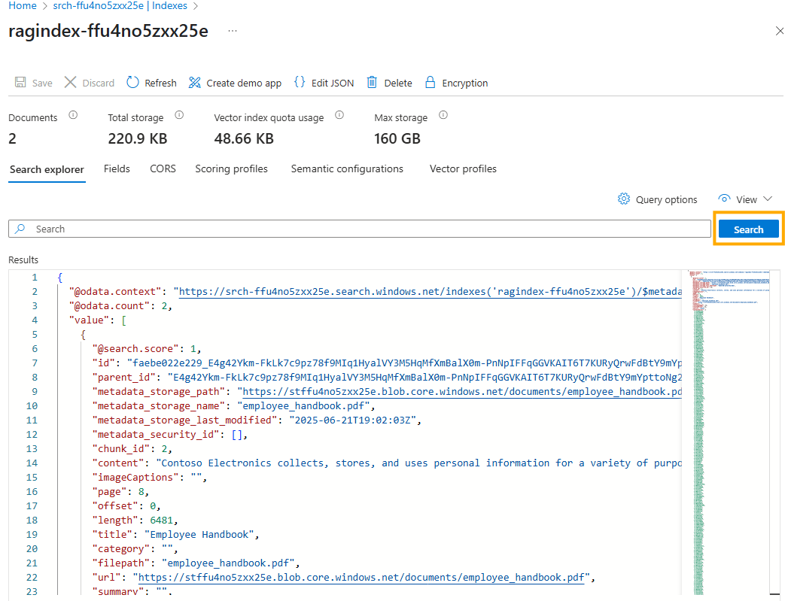
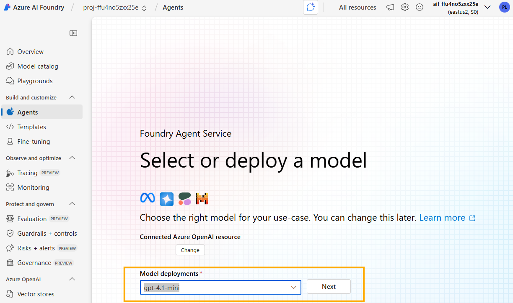
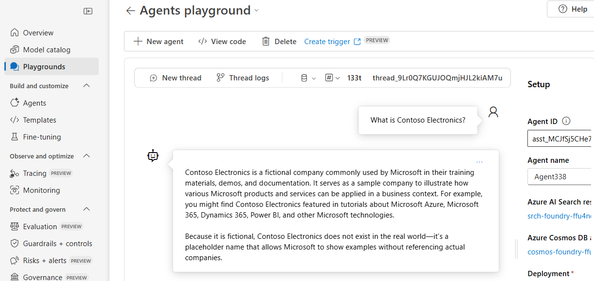
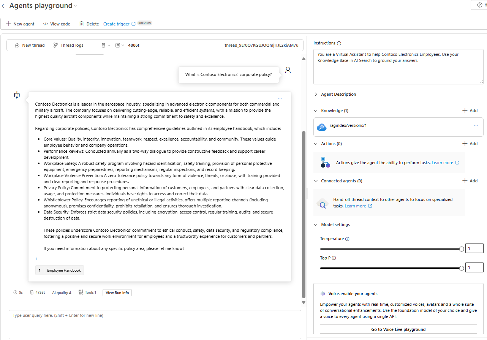

# From Idea to Prototype

> 🎥 **Watch the step-by-step demo**: [Prototyping with Azure AI Foundry](https://www.youtube.com/embed/ohgpsAIZ1w4?autoplay=1)

In this lab, you will select and compare AI models in Azure AI Foundry, then prototype an agent connected to your RAG index. The sample project is **Contoso Electronics**.

- Browse the **Model Catalog** in AI Agent Service  
- Run a **model comparison** using the 4.1 baseline model  
- Index your documents in an AI Search Index
- Launch the **Agent Playground**, hook up your RAG index, and test an agent  

## Success Criteria

- You can locate and explore models in the AI Agent Service catalog  
- You’ve run comparison between models  
- You’ve created an agent in the playground, connected it to the Contoso Electronics Employee Handbook index, and tested it with sample queries  


## Prerequisites

<details markdown="block">
<summary>Expand to view prerequisites</summary>

### Required Tools & Access  

- **Bootstraping**: Ensure you have completed the bootstraping process and have a running environment.  
- **Docker**, if you use Windows you can [Download and install Docker Desktop](https://docs.docker.com/get-started/introduction/get-docker-desktop/).  


</details>

## Task 1: Browse the Model Catalog

1. In the Azure Portal, navigate to your **AI Foundry** project from bootstraping.
2. In the Overview page select **Go to Azure AI Foundry portal**
3. In the AI Foundry portal Select **Model Catalog**.
4. Review the list of available models (e.g., `gpt-4o`, `gpt-4o-mini`, `gpt-4.1`, etc.).
5. Click on **gpt-4.1** to view its details:

   * Training data cut-off
   * Token limits in the Details pane
   * Cost and pricing
   * Regional availability
   * Retirement date

6. Click on the **Benchmarking** tab to compare **gpt-4.1** with other models across multiple dimensions.

> **Highlight:** Understanding model details helps balance capability, cost, and latency.

---

## Task 2: Compare Different Models

1. Return to the Model Catalog home page and click on the **Browse leaderboards** button.
2. In the **Trade-off charts** section:

   * A. Under *Quality vs Cost*, select only the models you want to compare (pick `gpt-4.1` and `gpt-4.1-mini`).
   * B. Under *Quality vs Throughput*, select the same models again to compare performance.

3. Observe how `gpt-4.1-mini` offers a good balance between quality, cost, and latency—often making it a solid option for early prototyping.
4. Based on the insights from the model details and comparison charts, you now have enough information to confidently select a model to start building your prototype. For this use case, we will proceed with `gpt-4.1-mini`.
5. In the *Trade-off Charts*, click directly on the `gpt-4.1-mini` bubble. A popup will appear.
6. In the popup, click **Go to model details**.
7. On the model detail page, click the **Use this model** button.
8. In the "Deploy gpt-4.1-mini" dialog, click **Deploy** (you can use default options).
9. After deployment is complete, you will be redirected to the deployment page.
10. Click the blue **Open in playground** button.
11. In the playground, ask:

    ```text
    What is Contoso Electronics?
    ```

   

12. Note: The response will be generic based on public data. In the next task, you'll use Azure AI Search to ground responses using your Employee Handbook.

---

## Task 3: Index Your **Employee Handbook** in Azure AI Search

To index the content, deploy the data ingestion service that chunks and indexes documents. Follow these steps:

### A. Prepare Your Environment

1. Open a terminal and navigate to your working directory:

   ```bash
   cd workspace
   ```
2. Create and enter a new folder for the ingestion service:

   ```bash
   mkdir gpt-rag-ingestion
   cd gpt-rag-ingestion
   ```
3. Initialize the project from the GPT-RAG ingestion template:

   ```bash
   azd init -t azure/gpt-rag-ingestion -b v2.0.3
   ```

   > **Important:** Select the same environment name used during bootstrapping.
4. Log in to Azure:

   ```bash
   az login
   ```
5. Refresh environment variables:

   ```bash
   azd env refresh
   ```
   > **Important:** Select the same environment name and resource group used during bootstrapping.

### B. Upload the Employee Handbook

6. Upload the [`employee_handbook.pdf`](https://github.com/Azure/gpt-rag-ingestion/blob/genaiops-workshop/samples/documents/contoso-eletronics/employee_handbook.pdf) to the **documents** container in your **Storage Account** (the one **without 'foundry' in its name**).

### C. Deploy the Ingestion Service

> [!IMPORTANT]
> Docker engine must be running to execute containerized applications in the next steps. I you want to confirm just run `docker run hello-world` in your terminal.

7. Deploy the project:

   ```bash
   azd deploy
   ```
   At the end of the process, you will see something like:

   

### D. Automatic Indexing

8. After the deployment completes, the ingestion service will automatically detect and index the uploaded document. This process typically takes a few minutes.

9. To verify the indexing is complete, go to the [Azure Portal](https://portal.azure.com) and navigate to your **AI Search** service (the one without 'foundry' in its name).

10. Go to the indexes area in your Search Service, find the index that starts with `ragindex` and click **Search** to confirm you have data ingested in your index:

   

---

## Task 4: Prototype in the Agent Playground

### A. Test Without the Index

1. Go to your project in the AI Foundry Portal.

2. Visit the **Agents** page.

3. Create a new agent by selecting the model deployment **gpt‑4.1‑mini** that you set up above.

   

4. Click on the newly created agent.

5. On the agent’s page, select **Try in Playground**.

6. In the chat window, ask:

   ```text
   What is Contoso Electronics?
   ```
   

7. Notice that the answer is generic and not grounded in your handbook.

### B. Attach the Contoso Electronics Index

1. In the right-hand **Setup** panel, go to the **Knowledge** section.
2. Click **Add AI Search Index**.
3. Choose **Index that re not part of this Project**.
4. Select the **AI Search resource connection** that corresponds to the service without 'foundry' in the name.
5. Choose the index that starts with `ragindex`.
6. Provide a display name (e.g., *ragindex*) and set the search mode to **Simple**.
7. Click **Connect**.

> [!Note] If you got a message like:
> *invalid_type: Invalid type for 'instructions': expected a string, but got null instead.*
> Don't worry we will solve it in a minute.

### C. Add Agent Instructions

1. In the **Setup** panel, under **Instructions**, paste the following:

   ```
   You are a Virtual Assistant to help Contoso Electronics Employees. Use your Knowledge Base in AI Search to ground your answers.
   ```

### D. Test With the Index

1. In the chat, ask:

   ```text
   What is Contoso Electronics' corporate policy?
   ```
2. You should now see responses grounded in the indexed handbook with citations.
3. Try another question:

   ```text
   What are Contoso Electronics Company Values?
   ```

   

> **Insight:** Grounded responses cite specific passages from your indexed handbook, improving accuracy and trust.

---

**✅ Congratulations!**
You’ve completed **From Idea to Prototype Lab**: explored models, performed benchmarking, and built a prototype agent using real documentation from Contoso Electronics.

Up next: **Building Lab**, where you’ll implement GenAI app features in code.